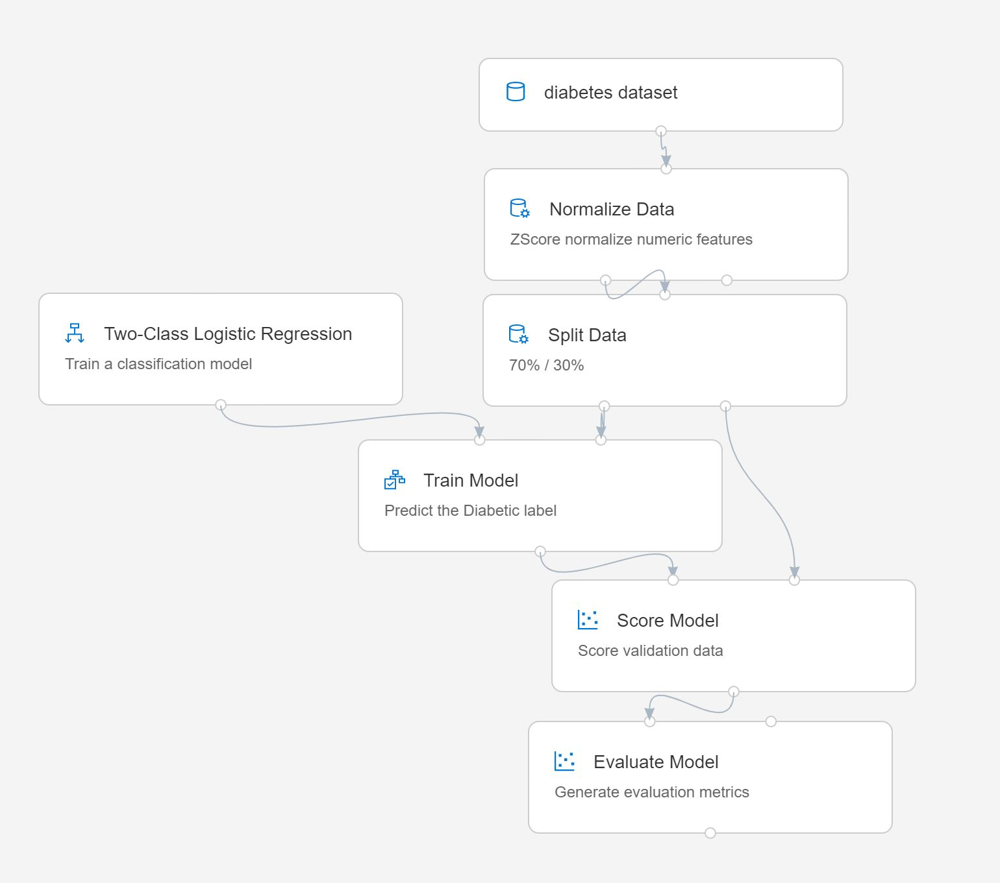
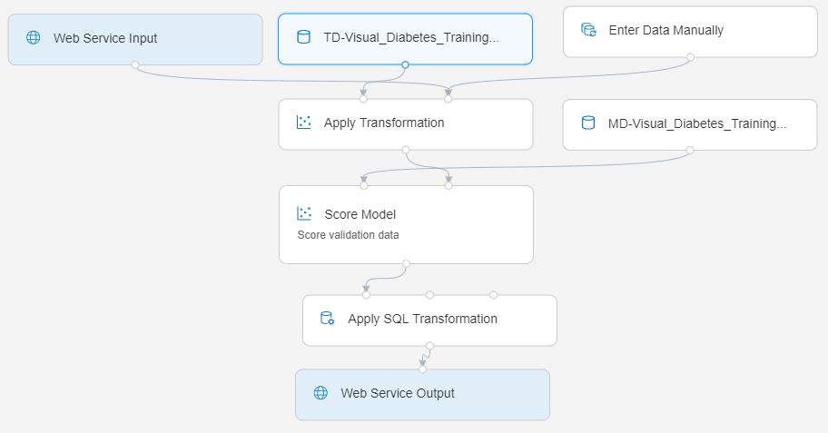

# Exercise 4: No-code ML with the Visual Designer

## Before You Start

Before you start this exercise, ensure that you have completed the [first execise](ex1.md).

## Task 1: Train a Model with the Designer

The Designer provides a drag & drop environment in which you can define a workflow, or *pipeline* of data ingestion, transformation, and model training modules to create a machine learning model. You can then publish this pipeline as a web service that client applications can use for *inferencing* (generating predictions from new data).

1. In the Azure Machine Learning *Studio* web interface, view the **Designer** page and create a new pipeline.
2. Change the default pipeline name (at the top) (**Pipeline-Created-on-*date***) to **Visual Diabetes Training**.
3. Use the **&#9881;** icon to view the settings for the pipeline, and note that you need to specify a compute target on which to run the pipeline. Click **Select compute target** and select the **cpu-cluster** compute target you created in the previous exercise.
4. On the left side of the designer, expand the **Datasets** section, and drag the **diabetes dataset** dataset you created in the previous exercise onto the canvas.
5. Select the **diabetes dataset** module on the canvas, and view its settings. Then on the **outputs** tab, click the **Visualize** icon (which looks liks a bar chart).
6. Review the schema of the data, noting that you can see the distributions of the various columns as histograms. Then close the visualization.
7. In the pane on the left, expand the **Data Transformation** section, which contains a wide range of modules you can use to transform data and pre-process it before model training. Drag a **Normalize Data** module to the canvas, below the **diabetes dataset** module. Then connect the output from the **diabetes dataset** module to the input of the **Normalize Data** module.
8. Select the **Normalize Data** module and view its settings, noting that it requires you to specify the transformation method and the columns to be transformed. Then, leaving the transformation as **ZScore**, edit the columns to includes the following column names:
    * PlasmaGlucose
    * DiastolicBloodPressure
    * TricepsThickness
    * SerumInsulin
    * BMI
    * DiabetesPedigree

    **Note**: We're normalizing the numeric columns put them on the same scale, and avoid columns with large values doiminating model training. You'd normally apply a whole bunch of pre-processing transformations like this to prepare your data for training, but we'll keep things simple in this exercise.

9. Now we're ready to split the data into separate datasets for training and validation. In the pane on the left, in the **Data Transformations** section, drag a **Split Data** module onto the canvas under the **Normalize Data** module. Then connect the *Transformed Dataset* (left) output of the **Normalize Data** module to the input of the **Split Data** module.
10. Select the **Split Data** module, and configure its settings as follows:
    * **Splitting mode** Split Rows
    * **Fraction of rows in the first output dataset**: 0.7
    * **Random seed**: 123
    * **Stratified split**: False
11. Expand the **Model Training** section in the pane on the left, and drag a **Train Model** module to the canvas, under the **Split Data** module. Then connect the *Result dataset1* (left) output of the **Split Data** module to the *Dataset* (right) input of the **Train Model** module.
12. The model we're training will predict the **Diabetic** value, so select the **Train Model** module and modify its settings to set the **Label column** to  **Diabetic** (matching the case and spelling exactly!)
13. The **Diabetic** label the model will predict is a binary column (1 for patients who have diabetes, 0 for patients who don't), so we need to train the model using a *classification* algorithm. Expand the **Machine Learning Algorithms** section, and under **Classification**, drag a **Two-Class Logistic Regression** module to the canvas, to the left of the **Split Data** module and above the **Train Model** module. Then connect its output to the **Untrained model** (left) input of the **Train Model** module.
14. To test the trained model, we need to use it to score the validation dataset we held back when we split the original data. Expand the **Model Scoring & Evaluation** section and drag a **Score Model** module to the canvas, below the **Train Model** module. Then connect the output of the **Train Model** module to the **Trained model** (left) inout of the **Score Model** module; and drag the **Results dataset2** (right) output of the **Split Data** module to the **Dataset** (right) input of the **Score Model** module.
15. To evaluate how well the model performs, we need to look at some metrics generated by scoring the validation dataset. From the **Model Scoring & Evaluation** section, drag an **Evaluate Model** module to the canvas, under the **Score Model** module, and connect the output of the **Score Model** module to the **Score dataset** (left) input of the **Evaluate Model** module.
16. Verify that your pipeline looks similar to the following (note that the image includes comments in each module to document what they're doing - it's not a bad idea to do this when you're using the Designer for a real project!):

    

17. At the top right, click **Run**. Then when prompted, create a new *experiment* named **visual-training**, and run it.  This will initialize the compute target and then run the pipeline, which may take several minutes.

    **Tip**: While it's running, you can view the pipeline and experiment that have been created in the **Pipelines** and **Experiments** pages in the **Studio** web interface. Switch back to the **Visual Diabetes Training** pipeline on the **Designer** page when you're done.

18. After the **Normalize Data** module has finished (indicated by a &#x2705; icon), select it, and in the **Settings** pane, on the **Outputs** tab, in the **Transformed dataset** section, click the **Visualize** icon (which looks like a column chart), and note that you can view statistics and distribution visualizations for the transformed columns.
19. Close the **Normalize Data** visualizations and wait for the rest of the modules to complete. Then visualize the **Evaluate Model** module to see the performance metrics for the model.

    **Note**: The performance of this model isn't all that great, partly because we performed only minimal feature engineering and pre-processing. You could try some different classification algorithms and compare the results (you can connect the outputs of the **Split Data** module to multiple **Train Model** and **Score Model** modules, and you can connect a second scored model to the **Evaluate Model** module to see a side-by-side comparison). The point of the exercise is simply to introduce you to the Designer interface, not to train a perfect model!

## Task 2: Create an Inference Pipeline

Now that you have a trained model, you can take the training pipeline and use it to create an inference pipeline for scoring new data.

1. In your **Visual Diabetes Training** pipeline, in the **Create inference pipeline** drop-down list, click **Real-time inference pipeline**. After a few seconds, a new version of your pipeline named **Visual Diabetes Training-real time inference** will be opened.
2. Rename the new pipeline to **Predict Diabetes**, and then review the new pipeline. Note that some of the transformations and training steps have been encapsulated in this pipeline so that the statistics from your training data will be used to normalize any new data values, and the trained model will be used to score the new data.
3. The inference pipeline assumes that new data will match the schema of the original training data, so the **diabetes dataset** module from the training pipeline is included. However, this input data includes the **Diabetic** label that the model predicts, which is unintuitive to include in new patient data for which a diabetes prediction has not yet been made. Delete this module and replace it with an **Enter Data Manually** module from the **Data Input and Output** section, connected to the same **dataset** input of the **Apply Transformation** module as the **Web Service Input**. Then modify the settings of the **Enter Data Manually** module to use the following CSV input, which includes feature values without labels for three new patient observations:

    ```CSV
    PatientID,Pregnancies,PlasmaGlucose,DiastolicBloodPressure,TricepsThickness,SerumInsulin,BMI,DiabetesPedigree,Age
    1882185,9,104,51,7,24,27.36983156,1.350472047,43
    1662484,6,73,61,35,24,18.74367404,1.074147566,75
    1228510,4,115,50,29,243,34.69215364,0.741159926,59
    ```

4. The inference pipeline includes the **Evaluate Model** module, which is not useful when predicting from new data, so delete this module.
5. The ouput from the **Score Model** module includes all of the input features as well as the predicted label and probability score. To limit the output to only the prediction and probability, delete the connection between the **Score Model** module and the **web Service Output**, add an **Apply SQL Transformation** module from the **Data Transformations** section, connect the output from the **Score Model** module to the **t1** (left-most) input of the **Apply SQL Transformation**, and connect the output of the **Apply SQL Transformation** module to the **Web Service Output**. Then modify the settings of the **Apply SQL Transformation** module to use the following SQL query script:

    ```SQL
    SELECT PatientID,
           [Scored Labels] AS DiabetesPrediction,
           [Scored Probabilities] AS Probability
    FROM t1
    ```

6. Verify that your pipeline looks similar to the following:

    

7. Run the pipeline as a new experiment named **predict-diabetes**. This may take a while!

    While you're waiting for the pipeline to run, you can go ahead and start the next task.

## Task 3: Publish a Web Service

Now you have an inference pipeline for real-time inferencing, which you can publish as a web service for client applications to use. To host this web service, you'll need to create a new compute target (you can't use the training compute target).

1. On the **Compute** page, review the existing compute targets under each tab. These should include:
    * **Notebook VMs**: The notebook VM you created in the previous exercise.
    * **Training Clusters**: The **cpu-cluster** compute you created in the previous exercise.
    * **Inference Clusters**: None (yet!)
    * **Attached Compute**: None (this is where you could attach a virtual machine or Databricks cluster that exists outside of your workspace)

2. On the **Inference Clusters** tab, add a new cluster with the following settings:
    * **Compute name**: aks-cluster
    * **Kubernetes Service**: Create new
    * **Region**: The same region as your workspace
    * **Virtual Machine size**: Standard_D3_v2
    * **Cluster purpose**: Production
    * **Number of nodes**: 3
    * **Network configuration**: Basic
    * **Enable SSL configuration**: Unselected

3. Wait for your inference cluster to be created. This may take quite a bit of time.
4. Switch back to the **Designer** tab and reopen your **Predict Diabetes** inference pipeline. If it has not yet finished running, await it's completion. Then visualize the output of the **Apply SQL Transformation** module to see the predicted labels and probabilties for the three patient observations in the input data.
5. At the top right, click **Deploy**, and set up a new real-time endpoint named **predict-diabetes** on the **aks-cluster** compute target you created.
6. Wait for the web service to be deployed - this can take a few minutes.
7. On the **Endpoints** page, open the **predict-diabetes** real-time endpoint.
8. When the **predict-diabetes** endpoint opens, on the **Test** page, note the default test input parameters and then click **Test** to submit them to the deployed web service and generate a prediction.
9. On the **Consume** tab, view the sample code that is provided for **Python**, and then copy the entire Python sample script to the clipboard.
10. On the **Compute** page, if your notebook VM is not running, start it. Then open Jupyter in a new browser tab.
11. In the **mlads-aml/notebooks** folder, open **04 - Using the Visual Designer.ipynb**.
12. In the notebook, paste the code you copied into the empty code cell.
13. Run the code cell and view the output returned by your web service.

## Task 4: Delete the Web Service and Compute

The web service is hosted in a Kubernetes cluster. If you don't intend to experiment with it further, you should delete the endpoint and the cluster to avoid accruing unnecessary Azure charges.

1. In the *Studio* web interface for your Azure ML workspace, on the **Endpoints** tab, select the **predict-diabetes** endpoint. Then click the **Delete** (&#128465;) button and confirm that you want to delete the endpoint.
2. On the **Compute** page, on the **Inference Clusters** tab, select the select the **aks-cluster** endpoint. Then click the **Delete** (&#128465;) button and confirm that you want to delete the compute target.

> **Note**: If you intend to continue exploring Azure ML, leave your Notebook VM running. If you're finished, or just taking a break, you might want to close the Jupyter tabs and **Stop** your Notebook VM to avoid incurring unnecessary costs.
>
> If you're completely finished exploring Azure ML, you should delete the resource group containing your Azure ML workspace and related resources.
